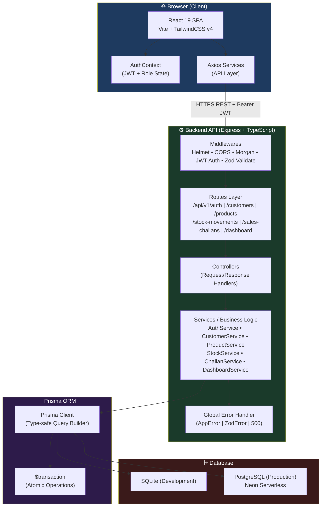
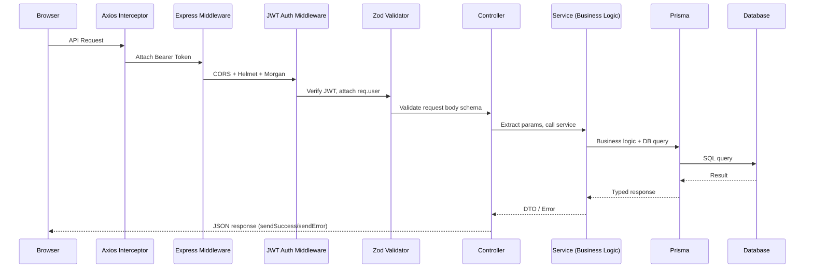
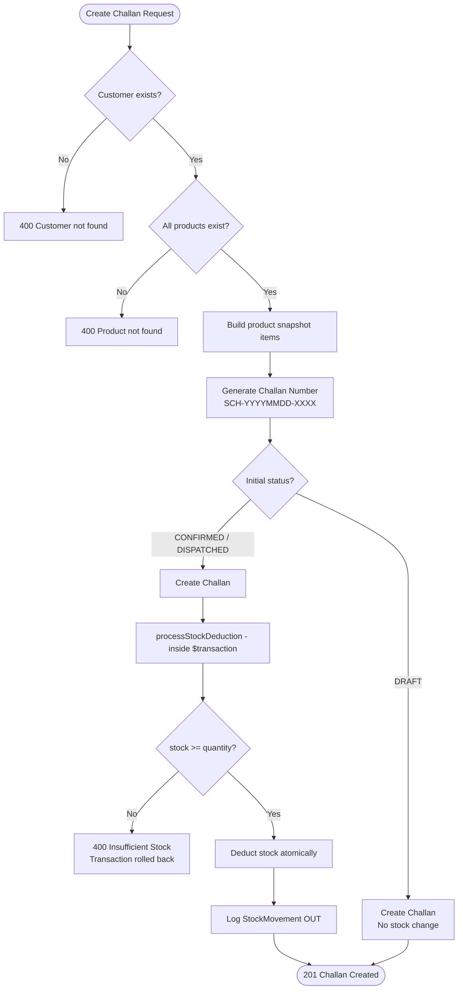
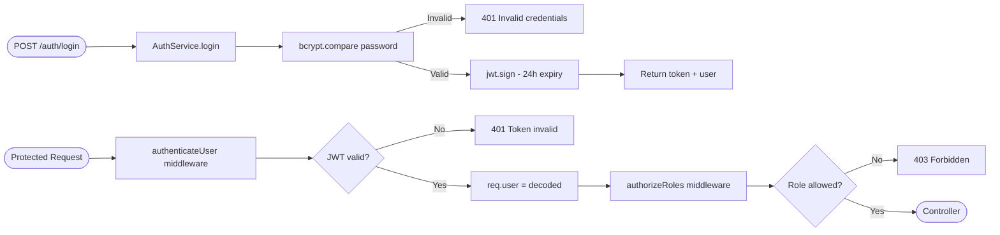
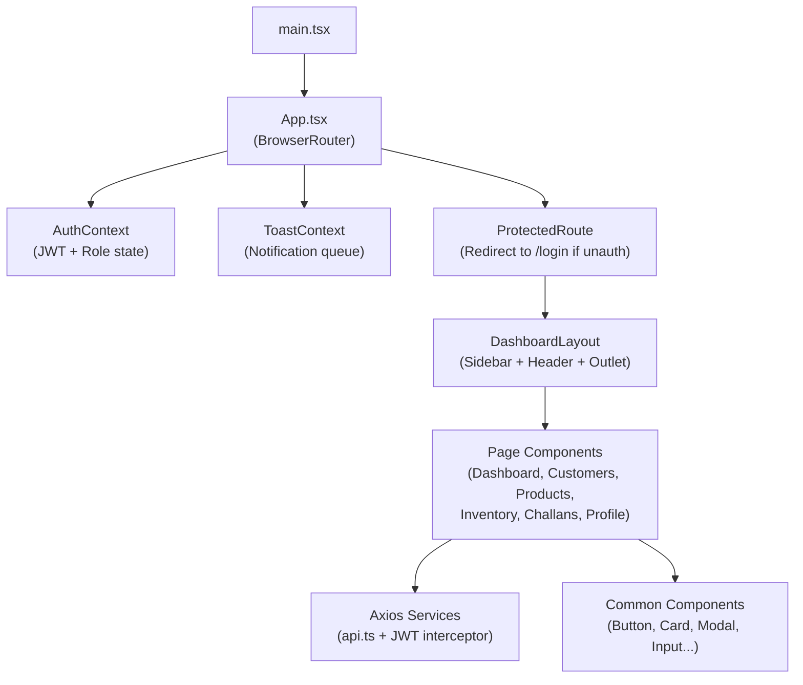
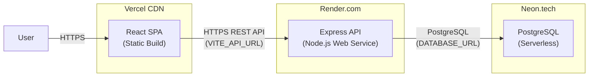

# 🏗️ System Architecture — Mini ERP + CRM Operations Portal

---

## Overview

The application follows a **clean, layered architecture** with clear separation of concerns across the frontend, API, and database tiers. Each layer has a single responsibility and communicates through well-defined interfaces.

---

## System Architecture Diagram

---

## Request Lifecycle

---

## Backend Layer Architecture

### Layer Responsibilities

| Layer | Files | Responsibility |
|:---|:---|:---|
| **Routes** | `*.routes.ts` | URL definitions, auth middleware wiring, Swagger JSDoc |
| **Controllers** | `*.controller.ts` | Parse request params, call service, send HTTP response |
| **Services** | `*.service.ts` | Business logic, validation rules, Prisma queries |
| **Middlewares** | `auth.ts`, `errorHandler.ts`, `validate.ts` | Cross-cutting concerns |
| **Validators** | `*.validator.ts` | Zod schemas for request body validation |
| **Config** | `env.ts`, `swagger.ts` | Environment validation, OpenAPI spec |
| **Utils** | `response.ts` | Consistent `sendSuccess` / `sendError` helpers |

### SOLID Principles Applied

- **Single Responsibility**: Each service class handles one domain (CustomerService, ChallanService, etc.)
- **Open/Closed**: New modules (e.g., Purchase Orders) can be added without modifying existing code
- **Interface Segregation**: DTOs defined per operation (CreateCustomerDTO, UpdateProductDTO)
- **Dependency Inversion**: Services depend on Prisma abstractions, not direct DB drivers

---

## Sales Challan Transaction Flow

---

## Authentication & Authorization Flow

---

## Frontend Architecture

---

## Deployment Architecture

