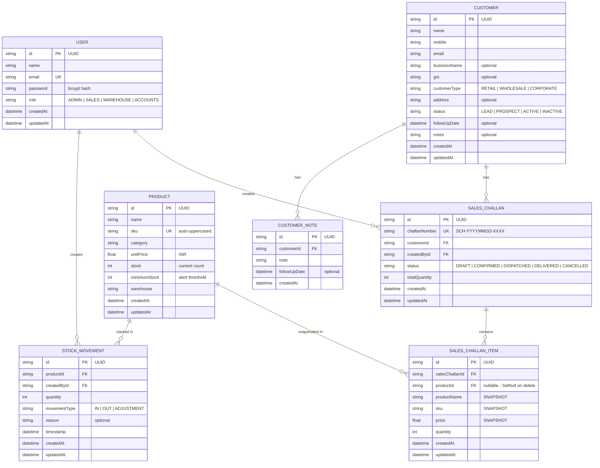

# 🗄️ Database Documentation — Mini ERP + CRM Operations Portal

---

## Overview

The database uses **Prisma ORM** with **SQLite** for local development and **PostgreSQL** for production. The schema is defined in [`backend/prisma/schema.prisma`](../backend/prisma/schema.prisma).

---

## Entity Relationship Diagram



---

## Table Descriptions

### `users`
Stores all staff accounts with hashed passwords and role assignments.

| Column | Type | Description |
|:---|:---|:---|
| `id` | UUID (PK) | Auto-generated unique ID |
| `name` | String | Full display name |
| `email` | String (UNIQUE) | Login identifier (lowercased) |
| `password` | String | bcrypt hash (10 rounds) |
| `role` | String | `ADMIN`, `SALES`, `WAREHOUSE`, `ACCOUNTS` |
| `createdAt` | DateTime | Account creation timestamp |
| `updatedAt` | DateTime | Last update timestamp |

**Indexes**: `email`, `role`

---

### `customers`
CRM contact records with status tracking and follow-up management.

| Column | Type | Description |
|:---|:---|:---|
| `id` | UUID (PK) | Auto-generated unique ID |
| `name` | String | Contact person name |
| `mobile` | String | Phone number |
| `email` | String | Contact email |
| `businessName` | String? | Company/business name |
| `gst` | String? | GST identification number |
| `customerType` | String | `RETAIL`, `WHOLESALE`, `CORPORATE` |
| `address` | String? | Full postal address |
| `status` | String | `LEAD`, `PROSPECT`, `ACTIVE`, `INACTIVE` |
| `followUpDate` | DateTime? | Next scheduled follow-up |
| `notes` | String? | Running summary notes |

**Indexes**: `email`, `mobile`, `status`, `followUpDate`
**Relations**: `salesChallans[]`, `notesHistory[]`

---

### `customer_notes`
Immutable audit log of follow-up notes — one record per note entry.

| Column | Type | Description |
|:---|:---|:---|
| `id` | UUID (PK) | Auto-generated unique ID |
| `customerId` | UUID (FK) | References `customers.id` (Cascade Delete) |
| `note` | String | The note content |
| `followUpDate` | DateTime? | Follow-up date set at time of note |
| `createdAt` | DateTime | Note creation timestamp |

**Indexes**: `customerId`

---

### `products`
Product catalog with current stock levels and reorder thresholds.

| Column | Type | Description |
|:---|:---|:---|
| `id` | UUID (PK) | Auto-generated unique ID |
| `name` | String | Product display name |
| `sku` | String (UNIQUE) | Stock Keeping Unit (auto-uppercased) |
| `category` | String | Product category grouping |
| `unitPrice` | Float | Price per unit in INR |
| `stock` | Int | Current available stock count |
| `minimumStock` | Int | Reorder alert threshold |
| `warehouse` | String | Physical warehouse location |

**Indexes**: `sku`, `category`, `warehouse`
**Relations**: `stockMovements[]`, `challanItems[]`
**Low Stock Rule**: `stock <= minimumStock` triggers alert

---

### `stock_movements`
Immutable audit log of all inventory changes.

| Column | Type | Description |
|:---|:---|:---|
| `id` | UUID (PK) | Auto-generated unique ID |
| `productId` | UUID (FK) | References `products.id` (Cascade Delete) |
| `createdById` | UUID (FK) | References `users.id` |
| `quantity` | Int | Units moved |
| `movementType` | String | `IN`, `OUT`, `ADJUSTMENT` |
| `reason` | String? | Human-readable reference |
| `timestamp` | DateTime | Movement timestamp |

**Indexes**: `productId`, `createdById`, `timestamp`
**Business Rules**:
- `IN`: `newStock = stock + quantity`
- `OUT`: `newStock = stock - quantity` (rejects if `stock < quantity`)
- `ADJUSTMENT`: `newStock = quantity` (absolute set)

---

### `sales_challans`
Sales order header records.

| Column | Type | Description |
|:---|:---|:---|
| `id` | UUID (PK) | Auto-generated unique ID |
| `challanNumber` | String (UNIQUE) | Format: `SCH-YYYYMMDD-XXXX` |
| `customerId` | UUID (FK) | References `customers.id` |
| `createdById` | UUID (FK) | References `users.id` |
| `status` | String | `DRAFT`, `CONFIRMED`, `DISPATCHED`, `DELIVERED`, `CANCELLED` |
| `totalQuantity` | Int | Sum of all item quantities |

**Indexes**: `challanNumber`, `customerId`, `createdById`, `status`
**Relations**: `items[]` (SalesChallanItem)
**Business Rules**:
- `DRAFT → CONFIRMED`: triggers `processStockDeduction($transaction)`
- `CANCELLED` or `DELIVERED`: no further status changes allowed

---

### `sales_challan_items`
Line items with **product snapshot** isolation. Historical records are never affected by future product edits.

| Column | Type | Description |
|:---|:---|:---|
| `id` | UUID (PK) | Auto-generated unique ID |
| `salesChallanId` | UUID (FK) | References `sales_challans.id` (Cascade Delete) |
| `productId` | UUID? (FK) | References `products.id` (SetNull on delete) |
| `productName` | String | **SNAPSHOT** — name at time of challan |
| `sku` | String | **SNAPSHOT** — SKU at time of challan |
| `price` | Float | **SNAPSHOT** — unit price at time of challan |
| `quantity` | Int | Quantity ordered |

**Indexes**: `salesChallanId`, `productId`
**Design Decision**: `productId` is nullable (`SetNull` on product delete) so historical challans remain intact even if the product is deleted later.

---

## Indexes Summary

| Table | Indexed Columns | Purpose |
|:---|:---|:---|
| `users` | `email`, `role` | Fast login lookup, role-based queries |
| `customers` | `email`, `mobile`, `status`, `followUpDate` | Search and filter performance |
| `customer_notes` | `customerId` | Fast notes lookup per customer |
| `products` | `sku`, `category`, `warehouse` | Search and filter performance |
| `stock_movements` | `productId`, `createdById`, `timestamp` | Audit log queries |
| `sales_challans` | `challanNumber`, `customerId`, `createdById`, `status` | Lookup and filter performance |
| `sales_challan_items` | `salesChallanId`, `productId` | JOIN performance |

---

## Migration Commands

```bash
cd backend

# Development: push schema changes without migration history
npx prisma db push

# Production: create named migration file
npx prisma migrate dev --name "description-of-change"

# Production: apply pending migrations
npx prisma migrate deploy

# Open visual database browser
npx prisma studio

# Re-generate Prisma Client after schema changes
npx prisma generate
```
