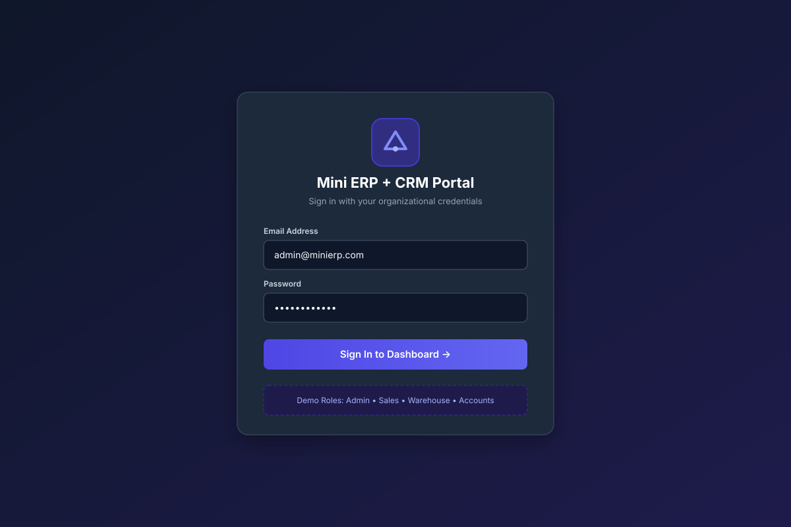
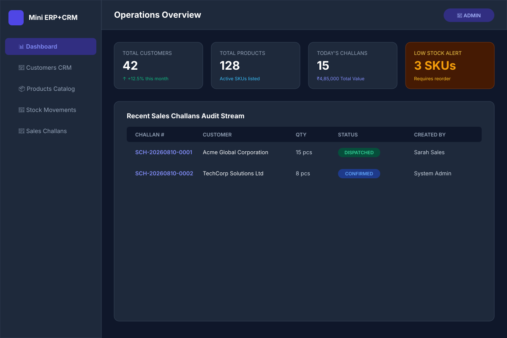

# 📸 Screenshots — Mini ERP + CRM Operations Portal

This folder contains application screenshots for documentation and the README.

---

## How to Capture Screenshots

Follow these steps to capture professional screenshots for this project:

### Prerequisites
1. Start the backend: `cd backend && npm run dev`
2. Start the frontend: `cd frontend && npm run dev`
3. Open `http://localhost:5173` in a browser at **1440×900** resolution
4. Use **Chrome DevTools** (F12 → Toggle Device Toolbar) or set window width manually

## 🎨 Visual UI Previews

Below are visual vector UI previews embedded for GitHub rendering:

### 1. Login Page (`01-login.svg`)


### 2. Operations Dashboard (`02-dashboard.svg`)


---

## How to Capture Additional Screenshots

### 1. Login Page (`01-login.png`)
- URL: `http://localhost:5173/login`
- Shows: Login form with company branding, demo credential quick-login buttons
- State: Pre-filled with `admin@minierp.com`

### 2. Dashboard (`02-dashboard.png`)
- URL: `http://localhost:5173/dashboard`
- Login as: **Admin** (`admin@minierp.com` / `Admin@123`)
- Shows: All 5 KPI cards with data, Recent Challans list, Recent Customers list

### 3. Customers List (`03-customers.png`)
- URL: `http://localhost:5173/customers`
- Shows: Customer table with search bar, status badges (ACTIVE, LEAD, PROSPECT), pagination

### 4. Customer Detail (`04-customer-detail.png`)
- URL: `http://localhost:5173/customers/{any-id}`
- Shows: Customer info panel, Notes History tab, Past Challans tab

### 5. Products Catalog (`05-products.png`)
- URL: `http://localhost:5173/products`
- Shows: Product table with Low Stock Alert badges in red, SKU codes

### 6. Stock Movements / Inventory (`06-inventory.png`)
- URL: `http://localhost:5173/inventory`
- Shows: Stock movement log with IN/OUT/ADJUSTMENT badges, product names, timestamps

### 7. Sales Challans List (`07-sales-challans.png`)
- URL: `http://localhost:5173/sales-challans`
- Shows: Challan list with challan numbers (SCH-YYYYMMDD-XXXX), status badges, customer names

### 8. Create Challan (`08-create-challan.png`)
- URL: `http://localhost:5173/sales-challans/new`
- Shows: Multi-product selection form, customer dropdown, status selector

### 9. Profile Page (`09-profile.png`)
- URL: `http://localhost:5173/profile`
- Shows: Current user info, role badge

### 10. Swagger API Docs (`10-swagger.png`)
- URL: `http://localhost:5001/docs`
- Shows: Expanded Auth or Customers section with endpoints listed

### 11. Responsive Mobile View (`11-mobile-dashboard.png`)
- URL: `http://localhost:5173/dashboard`
- DevTools Device: iPhone 13 (390×844)
- Shows: Collapsible sidebar, KPI cards in single column layout

### 12. Low Stock Alert View (`12-low-stock.png`)
- URL: `http://localhost:5173/products?lowStock=true`
- Shows: Filtered view with only low-stock products highlighted

---

## Naming Convention

```
docs/screenshots/
├── 01-login.png
├── 02-dashboard.png
├── 03-customers.png
├── 04-customer-detail.png
├── 05-products.png
├── 06-inventory.png
├── 07-sales-challans.png
├── 08-create-challan.png
├── 09-profile.png
├── 10-swagger.png
├── 11-mobile-dashboard.png
└── 12-low-stock.png
```

---

## Screenshot Tips

- Use **PNG format** for UI screenshots (lossless)
- Ensure the browser window shows **populated data** (seeded demo data)
- Capture at **1440px width** for consistent documentation
- For mobile screenshots, use Chrome DevTools device emulation
- Remove any personal bookmarks or browser extensions from the toolbar
